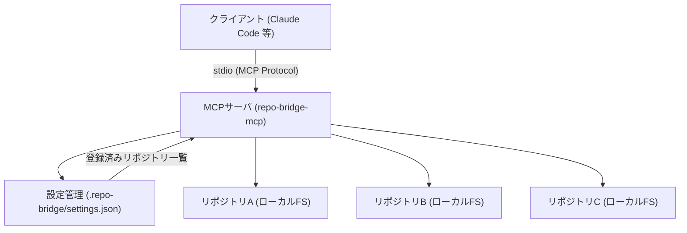
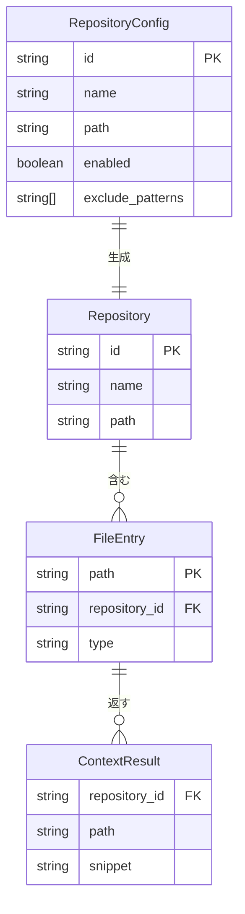

# 設計ドキュメント — repo-bridge-mcp

## 概要

複数リポジトリに分散したコード・ドキュメントを横断的に参照するMCPサーバを構築する。
Claude CodeなどのAIアシスタントと開発者が対象で、作業コンテキストに応じた関連ファイルを動的に提供する。
ノイズを最小化しながら、登録リポジトリ内の情報に安全にアクセスできる環境を実現する。

---

## アーキテクチャ

### コンポーネント構成

| コンポーネント | モジュール | 責務 |
|--------------|-----------|------|
| MCPサーバ本体 | `index.ts` | stdioトランスポートでMCPプロトコルを処理、ツールリクエストをディスパッチ |
| ファイル検索・読み取り | `file-searcher.ts` | globパターン検索・キーワード検索・ファイル読み取り・パストラバーサル防止 |
| コンテキストプロバイダ | `context-provider.ts` | CWD自動判定によるリポジトリ絞り込みとコンテキスト検索 |
| 設定管理 | `repository-manager.ts` | `.repo-bridge/settings.json` の読み込みと型バリデーション |

---

## 機能一覧

| 機能ID | 機能名 | 優先度 | 概要 |
|--------|--------|--------|------|
| F-001 | リポジトリ登録 | 高 | 参照対象リポジトリをプロジェクト配下の `.repo-bridge/settings.json` の `repositories` 配列で管理（手動作成） |
| F-002 | ファイル検索・読み取り | 高 | 登録リポジトリ横断でglobパターンによるファイル検索、および指定ファイルの内容取得 |
| F-003 | コンテキスト取得 | 高 | 作業コンテキスト文字列をキーワードとしてファイル内容を検索し、関連スニペットを動的取得。省略時はCWDから対象リポジトリを自動判定 |
| F-004 | コンテンツ検索 | 中 | キーワードで登録リポジトリのファイル内容を横断検索し、ヒット行前後3行のスニペットを返す |

---

## MCP ツール設計

MCPサーバはHTTPではなくstdioトランスポートを使用するため、APIエンドポイントの代わりにMCPツールとして定義する。

| ツール名 | 概要 | 主な入力パラメータ | 実装状態 |
|---------|------|------------------|---------|
| `list_repositories` | 登録済みリポジトリの一覧取得 | なし | 実装済み |
| `search_files` | ファイル名・パターンによる横断検索 | `pattern`, `repository_id?` | 実装済み |
| `read_file` | 指定ファイルの内容取得 | `repository_id`, `path` | 実装済み |
| `search_content` | ファイル内容のキーワード検索（前後3行スニペット付き） | `keyword`, `repository_id?` | 実装済み（ツール登録のみ未完） |
| `get_context` | 作業コンテキストに応じた関連ファイル取得（CWD自動判定） | `context`, `repository_id?` | 実装済み |

---

## データモデル

### 各エンティティの説明

| エンティティ | 説明 |
|------------|------|
| `RepositoryConfig` | `.repo-bridge/settings.json` の `repositories` 配列の1要素 = 1リポジトリ設定 |
| `Repository` | 実行時のリポジトリ表現。`RepositoryConfig` から生成される |
| `FileEntry` | リポジトリ内の1ファイルを表すエントリ |
| `ContextResult` | コンテキスト取得クエリに対する結果（リポジトリID・ファイルパス・スニペット） |

---

## 非機能要件

| 項目 | 要件 |
|------|------|
| パフォーマンス | ファイル検索レスポンス 1000ms以内（95パーセンタイル） |
| セキュリティ | `readFileContent` でパストラバーサル検出時は即時エラー（`resolve` による絶対パス比較） |
| 設定管理 | `.repo-bridge/settings.json` の `repositories` 配列で `enabled` フラグ・除外パターンを管理 |
| 堅牢性 | 設定ファイルのパース失敗・リポジトリパス不正は個別スキップし、他のリポジトリ処理を継続 |

---

## 制約・前提条件

### スコープ内

- ローカルファイルシステム上のリポジトリのファイル読み取り・検索
- stdioトランスポートによるMCP通信

### スコープ外

- コード実行・変更・コミット操作
- リモートリポジトリへの直接接続
- リポジトリ登録のUI（手動での `.repo-bridge/settings.json` 編集が前提）

### 前提条件

- トランスポート: stdio（ローカル実行のみ、リモート接続は対象外）
- 対応リポジトリ: ローカルファイルシステム上のgitリポジトリ
- 実行環境: Node.js
