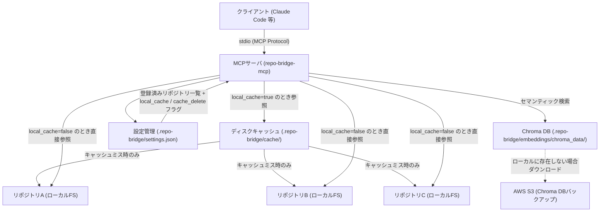
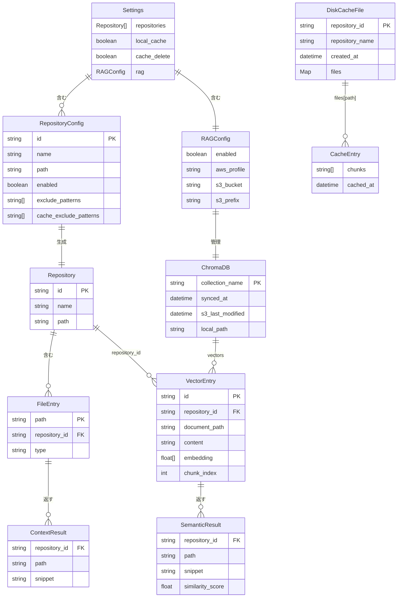
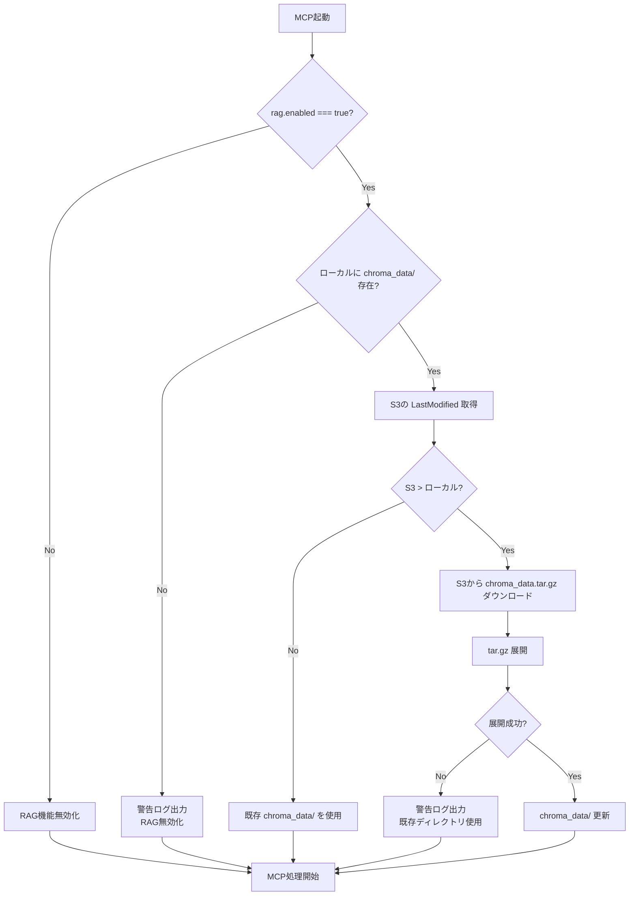

# 設計ドキュメント — repo-bridge-mcp

## 概要

複数リポジトリに分散したコード・ドキュメントを横断的に参照するMCPサーバを構築する。
Claude CodeなどのAIアシスタントと開発者が対象で、作業コンテキストに応じた関連ファイルを動的に提供する。
ノイズを最小化しながら、登録リポジトリ内の情報に安全にアクセスできる環境を実現する。

---

## アーキテクチャ



### コンポーネント構成

| コンポーネント | モジュール | 責務 |
| ------------ | --------- | ------ |
| MCPサーバ本体 | `index.ts` | stdioトランスポートでMCPプロトコルを処理、ツールリクエストをディスパッチ |
| ファイル検索・読み取り | `file-searcher.ts` | globパターン検索・キーワード検索・ファイル読み取り・パストラバーサル防止 |
| コンテキストプロバイダ | `context-provider.ts` | CWD自動判定によるリポジトリ絞り込み・キーワード抽出によるOR検索・スコアリング |
| キーワード抽出 | `keyword-extractor.ts` | kuromojiによる形態素解析で名詞・動詞・英数を抽出し、OR検索用キーワード列を生成 |
| 設定管理 | `repository-manager.ts` | `.repo-bridge/settings.json` の読み込みと型バリデーション |
| キャッシュストア | `cache-store.ts` | `.repo-bridge/cache/{repository_id}.json` へのディスクキャッシュ読み書き。`local_cache` フラグで有効/無効を切替、`cache_delete` フラグで起動時の削除制御 |
| RAGプロバイダ | `rag-provider.ts` | ドキュメントのセマンティック検索。ローカルChroma DB優先、存在しない場合S3からダウンロード |
| Chromaストア | `chroma-store.ts` | `.repo-bridge/embeddings/chroma_data/` の読み込みとベクトル検索。S3との同期を管理 |
| ドキュメントフェッチャー | `document-fetcher.ts` | S3から元ドキュメントを取得し、`.repo-bridge/fetched/` にキャッシュ（TTL 24時間） |

---

## 機能一覧

| 機能ID | 機能名 | 優先度 | 概要 |
| ------ | ------ | ------ | ------ |
| F-001 | リポジトリ登録 | 高 | 参照対象リポジトリをプロジェクト配下の `.repo-bridge/settings.json` の `repositories` 配列で管理（手動作成） |
| F-002 | ファイル検索・読み取り | 高 | 登録リポジトリ横断でglobパターンによるファイル検索、および指定ファイルの内容取得 |
| F-003 | コンテキスト取得 | 高 | 作業コンテキスト文字列をキーワードとしてファイル内容を検索し、関連スニペットを動的取得。省略時はCWDから対象リポジトリを自動判定 |
| F-004 | コンテンツ検索 | 中 | キーワードで登録リポジトリのファイル内容を横断検索し、ヒット行前後3行のスニペットを返す |
| F-005 | ディスクキャッシュ | 中 | `read_file` で読んだファイル内容を20行チャンクに分割して `.repo-bridge/cache/{repository_id}.json` に保存し、繰り返し呼び出し時のディスクIOを削減。`local_cache: true` で有効化、`cache_delete: true`（デフォルト）で起動時にキャッシュを削除して初期化。リポジトリ単位で `cache_exclude_patterns` による除外指定が可能 |
| F-006 | OR検索・キーワード抽出 | 中 | コンテキスト文字列をkuromojiで形態素解析し、名詞・動詞・英数を抽出してOR検索を実行。複数キーワードのヒット数をスコアとして降順ソートし、上位20件を返す。抽出結果が空の場合はコンテキスト文字列をそのままキーワードとしてフォールバック |
| F-007 | セマンティック検索（RAG） | 中 | ドキュメント（`**/*.md`, `**/*.txt`）に対するベクトル検索。全リポジトリ統合ChromaDBをローカル `.repo-bridge/embeddings/chroma_data/` から参照し、存在しない場合はS3からダウンロード・展開。AWS側で事前生成したEmbedding（OpenAI / Bedrock）を使用。Skills（スラッシュコマンド）経由で明示的に呼び出し |
| F-008 | Chroma DB同期 | 中 | MCP起動時にRAG有効なら、S3の `LastModified` とローカルディレクトリの更新日時を比較し、S3が新しければ圧縮ファイルをダウンロード・展開。ローカルにディレクトリが存在しない場合は警告を出してRAG無効化 |
| F-009 | 元ドキュメント取得 | 中 | S3から元のドキュメントファイル（`.md`, `.txt`）を取得。RAG検索結果の詳細確認用。`/rag-fetch <path>` で呼び出し、`.repo-bridge/fetched/` に保存してTTL 24時間でキャッシュ |
| F-010 | RAG状態確認 | 低 | RAG機能の有効/無効、ローカルDB存在、最終同期日時を表示。`/rag-status` で呼び出し |

---

## MCP ツール設計

MCPサーバはHTTPではなくstdioトランスポートを使用するため、APIエンドポイントの代わりにMCPツールとして定義する。

| ツール名 | 概要 | 主な入力パラメータ | 実装状態 |
| --------- | ------ | ------------------ | --------- |
| `list_repositories` | 登録済みリポジトリの一覧取得 | なし | 実装済み |
| `search_files` | ファイル名・パターンによる横断検索 | `pattern`, `repository_id?` | 実装済み |
| `read_file` | 指定ファイルの内容取得 | `repository_id`, `path` | 実装済み |
| `search_content` | ファイル内容のキーワード検索（前後3行スニペット付き） | `keyword`, `repository_id?` | 実装済み（ツール登録のみ未完） |
| `get_context` | 作業コンテキストに応じた関連ファイル取得（CWD自動判定） | `context`, `repository_id?` | 実装済み |
| `semantic_search` | ドキュメントのセマンティック検索（ベクトル類似度） | `query`, `top_k?`, `repository_id?` | 未実装 |
| `sync_embeddings` | S3からChroma DBを強制再ダウンロード | なし | 未実装 |
| `fetch_document` | S3から元ドキュメントを取得 | `path`, `repository_id?` | 未実装 |
| `rag_status` | RAG機能の状態確認 | なし | 未実装 |

### Skills設計

| Skill名 | 概要 | 呼び出し方法 | 内部処理 |
| --------- | ------ | ---------- | -------- |
| `rag-search` | RAGによるセマンティック検索 | `/rag-search <query>` | `semantic_search` ツールを呼び出し、結果を整形して返す |
| `rag-sync` | Embedding DB強制同期 | `/rag-sync` | `sync_embeddings` ツールを呼び出し、結果を返す |
| `rag-fetch` | 元ドキュメント取得 | `/rag-fetch <path>` | `fetch_document` ツールを呼び出し、内容を表示 |
| `rag-status` | RAG状態確認 | `/rag-status` | `rag_status` ツールを呼び出し、状態を整形して表示 |

---

## データモデル



### 各エンティティの説明

| エンティティ | 説明 |
| ------------ | ------ |
| `Settings` | `.repo-bridge/settings.json` のルートオブジェクト。`repositories` 配列と `local_cache`・`cache_delete`・`rag` フラグを持つ |
| `RAGConfig` | RAG機能の設定。`enabled`: RAG有効/無効、`aws_profile`: AWSプロファイル名、`s3_bucket`: S3バケット名、`s3_prefix`: S3プレフィクス（例: `embeddings/`） |
| `RepositoryConfig` | `Settings.repositories` 配列の1要素 = 1リポジトリ設定。`cache_exclude_patterns` でキャッシュ除外パターンを指定可能 |
| `Repository` | 実行時のリポジトリ表現。`RepositoryConfig` から生成される |
| `FileEntry` | リポジトリ内の1ファイルを表すエントリ |
| `ContextResult` | コンテキスト取得クエリに対する結果（リポジトリID・ファイルパス・スニペット） |
| `DiskCacheFile` | `.repo-bridge/cache/{repository_id}.json` の内容。リポジトリ単位でファイルキャッシュを保持 |
| `CacheEntry` | キャッシュファイル内の1ファイル分のエントリ。20行チャンク配列と読み込み日時を持つ |
| `ChromaDB` | `.repo-bridge/embeddings/chroma_data/` の内容。全リポジトリ統合ドキュメントのベクトル表現を保持。`synced_at`: 最終同期日時、`s3_last_modified`: S3の `LastModified` タイムスタンプ、`local_path`: ローカルディレクトリパス |
| `VectorEntry` | Chroma DB内の1チャンク分のエントリ。`id`: 一意識別子、`repository_id`: リポジトリID、`document_path`: ドキュメントパス、`content`: チャンク内容、`embedding`: ベクトル、`chunk_index`: チャンク番号 |
| `SemanticResult` | セマンティック検索クエリに対する結果（リポジトリID・ファイルパス・スニペット・類似度スコア） |

---

## 非機能要件

| 項目 | 要件 |
| ------ | ------ |
| パフォーマンス | ファイル検索レスポンス 1000ms以内（95パーセンタイル）。`local_cache=true` 時は2回目以降の `walkDir` コールをゼロディスクIOで返す。セマンティック検索は500ms以内（ローカルChroma DB使用時） |
| セキュリティ | `readFileContent` でパストラバーサル検出時は即時エラー（`resolve` による絶対パス比較） |
| 設定管理 | `.repo-bridge/settings.json` の `repositories` 配列で `enabled` フラグ・除外パターンを管理。`local_cache` フラグでキャッシュ有効/無効を切替 |
| 堅牢性 | 設定ファイルのパース失敗・リポジトリパス不正は個別スキップし、他のリポジトリ処理を継続 |
| キャッシュ一貫性 | `cache_delete: true`（デフォルト）時はMCP起動毎に `.repo-bridge/cache/` を削除して初期化。`cache_delete: false` 時は前回キャッシュを再利用。TTLなし、手動削除または `cache_delete: true` での再起動でキャッシュをリセット |
| キャッシュ除外 | リポジトリ単位で `cache_exclude_patterns`（globパターン）を指定し、キャッシュ対象外ファイルを制御。未指定時は全ファイルが対象 |
| RAG有効化 | `settings.json` の `rag.enabled: true` 時にRAG機能を有効化。起動時にローカル `.repo-bridge/embeddings/chroma_data/` が存在しない場合は警告を出してRAG無効化し、MCP処理を継続 |
| Chroma DB同期 | MCP起動時、`rag.enabled: true` なら S3の `{s3_bucket}/{s3_prefix}/chroma_data.tar.gz` の `LastModified` とローカルディレクトリの更新日時を比較。S3が新しければダウンロード・展開、失敗時は既存ディレクトリを使用して警告ログ出力 |
| Embedding対象 | ドキュメントファイル（`**/*.md`, `**/*.txt`）のみ。ソースコードは対象外（Embedding生成はAWS側で実施） |
| ストレージ容量 | Chroma DB（全リポジトリ統合、圧縮前）は50〜200MB。ローカルに500MB以上の空き容量を推奨 |
| AWS認証 | `~/.aws/credentials` のプロファイル名（`rag.aws_profile`）でS3アクセス。環境変数 `AWS_PROFILE` も使用可能 |
| ドキュメントフェッチ | S3パス: `{s3_bucket}/{s3_prefix}/documents/{repository_id}/{file_path}`。ローカル保存先: `.repo-bridge/fetched/{repository_id}/{file_path}`。TTL 24時間でキャッシュ |

---

## 制約・前提条件

### スコープ内

- ローカルファイルシステム上のリポジトリのファイル読み取り・検索
- stdioトランスポートによるMCP通信
- ドキュメント（`.md`, `.txt`）に対するセマンティック検索
- S3からのEmbeddingデータベース同期

### スコープ外

- コード実行・変更・コミット操作
- リモートリポジトリへの直接接続
- リポジトリ登録のUI（手動での `.repo-bridge/settings.json` 編集が前提）
- Embedding生成プロセス（AWS側で事前生成したChroma DBを使用）
  - ドキュメントスキャン・ハッシュ計算
  - OpenAI / Bedrock API呼び出し
  - Chroma DBへの格納・S3アップロード
- ソースコードのベクトル検索（ドキュメントのみ対象）

### 前提条件

- トランスポート: stdio（ローカル実行のみ、リモート接続は対象外）
- 対応リポジトリ: ローカルファイルシステム上のgitリポジトリ
- 実行環境: Node.js 18以上
- Embedding生成: OpenAI / AWS Bedrock（AWS側で実施、MCPサーバはスコープ外）
- ベクトルDB: Chroma（ChromaDB Node.jsクライアント `chromadb` パッケージ使用）
- Embeddingモデル: OpenAI `text-embedding-3-small`（512次元）または `text-embedding-ada-002`（1536次元）を想定
- ローカルストレージ: 500MB以上の空き容量
- AWS S3アクセス: Chroma DBの圧縮ファイル（`chroma_data.tar.gz`）同期用（読み取り専用）。`~/.aws/credentials` のプロファイル認証を使用

---

## RAG機能詳細設計

### 設定ファイル例（`.repo-bridge/settings.json`）

```json
{
  "repositories": [ /* 既存設定 */ ],
  "local_cache": true,
  "cache_delete": true,
  "rag": {
    "enabled": true,
    "aws_profile": "default",
    "s3_bucket": "my-embeddings-bucket",
    "s3_prefix": "embeddings/"
  }
}
```

### MCP起動時の処理フロー



### Skills実装

#### `/rag-search`

```markdown
# RAG Search Skill

RAGによるセマンティック検索を実行する。

## 使い方

/rag-search <検索クエリ>

## 処理フロー

1. `semantic_search` ツールを呼び出し
2. 結果を整形（類似度スコア降順）
3. ユーザに返す
```

#### `/rag-sync`

```markdown
# RAG Sync Skill

S3からChroma DBを強制的に再ダウンロード・展開する。

## 使い方

/rag-sync

## 処理フロー

1. `sync_embeddings` ツールを呼び出し
2. ダウンロード・展開結果を表示
```

#### `/rag-fetch`

```markdown
# RAG Fetch Skill

S3から元ドキュメントを取得して内容を表示する。

## 使い方

/rag-fetch <path>

## 処理フロー

1. `fetch_document` ツールを呼び出し
2. 取得したドキュメント内容を表示
3. `.repo-bridge/fetched/` にキャッシュ（TTL 24時間）
```

#### `/rag-status`

```markdown
# RAG Status Skill

RAG機能の現在の状態を確認する。

## 使い方

/rag-status

## 処理フロー

1. `rag_status` ツールを呼び出し
2. 有効/無効、ローカルDB存在、最終同期日時を整形して表示
```

### ベクトルDB選定理由

#### Chromaを採用

| 項目 | 評価 | 理由 |
| ---- | ---- | ---- |
| ローカルファイル保存 | ◎ | ディレクトリ構造で保存、S3との同期が容易 |
| TypeScript SDK | ◎ | `chromadb` パッケージでNode.jsから直接利用可能 |
| 組み込みモード | ◎ | 別プロセス不要、MCPサーバプロセス内で完結 |
| スケール | ◯ | 〜1M vectors（想定規模50〜200MBに十分） |
| `repository_id`フィルタリング | ◎ | `metadata`に格納し`where`句で絞り込み可能 |
| セットアップ容易さ | ◎ | `npm install chromadb`のみ、Docker不要 |

### VectorEntryデータ構造

```typescript
interface VectorEntry {
  id: string;                    // 一意識別子（例: "repo-bridge-mcp/docs/design.md#chunk-0"）
  repository_id: string;         // リポジトリID（検索時のフィルタリング用）
  document_path: string;         // ドキュメントパス（リポジトリルートからの相対）
  content: string;               // チャンク化されたテキスト内容
  embedding: number[];           // Embeddingベクトル（512次元 or 1536次元）
  chunk_index: number;           // ドキュメント内のチャンク番号（0始まり）
}
```

### S3パス設計

```text
s3://{s3_bucket}/{s3_prefix}/chroma_data.tar.gz  # Chroma DBディレクトリの圧縮ファイル
s3://{s3_bucket}/{s3_prefix}/documents/{repository_id}/{file_path}  # 元ドキュメント（オプション）
```

**ローカル展開先**:

```text
.repo-bridge/embeddings/chroma_data/  # tar.gz展開後のChromaディレクトリ
.repo-bridge/fetched/{repository_id}/{file_path}  # 元ドキュメントキャッシュ（TTL 24時間）
```
