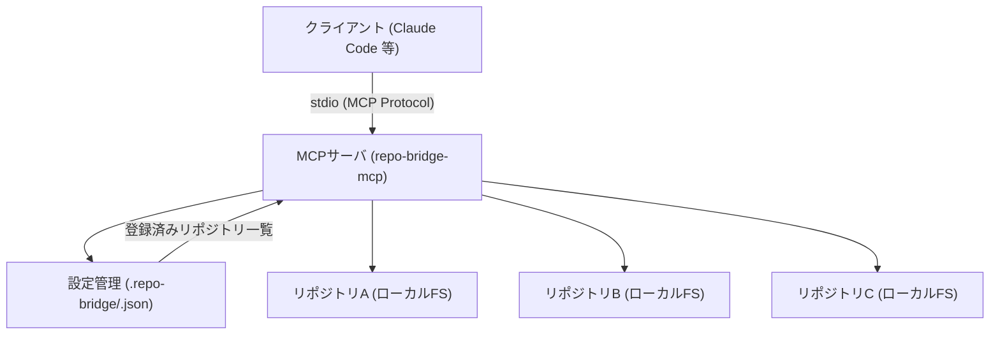
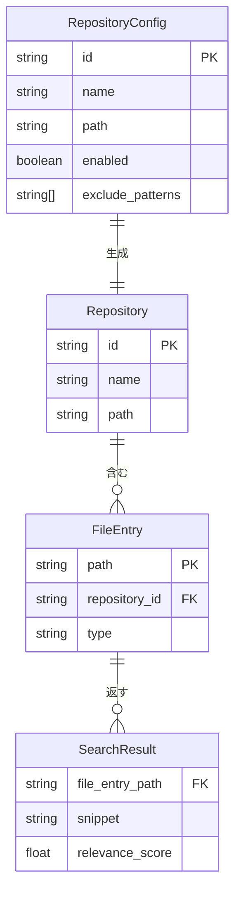

# 設計ドキュメント — repo-bridge-mcp

## 概要

複数リポジトリに分散したコード・ドキュメントを横断的に参照するMCPサーバを構築する。
Claude CodeなどのAIアシスタントと開発者が対象で、作業コンテキストに応じた関連ファイルを動的に提供する。
ノイズを最小化しながら、登録リポジトリ内の情報に安全にアクセスできる環境を実現する。

---

## アーキテクチャ

### コンポーネント構成

| コンポーネント | 責務 |
|--------------|------|
| MCPサーバ本体 | stdioトランスポートでMCPプロトコルを処理、ツールリクエストをディスパッチ |
| リポジトリアダプタ | ローカルファイルシステム上のリポジトリへのファイル読み取り・検索操作を提供 |
| 設定管理 | `.repo-bridge/<repo-id>.json` を読み込み、登録リポジトリ情報を管理 |

---

## 機能一覧

| 機能ID | 機能名 | 優先度 | 概要 |
|--------|--------|--------|------|
| F-001 | リポジトリ登録 | 高 | 参照対象リポジトリをプロジェクト配下の `.repo-bridge/<repo-id>.json` で管理（手動作成） |
| F-002 | ファイル検索 | 高 | 登録リポジトリ横断でファイル名・パターンによる検索・取得 |
| F-003 | コンテキスト取得 | 高 | 作業コンテキストに応じた関連ファイルの動的取得 |
| F-004 | ドキュメント参照 | 中 | docs配下のMarkdownファイルの参照 |
| F-005 | コード参照 | 中 | ソースコードファイルの参照 |

---

## MCP ツール設計

MCPサーバはHTTPではなくstdioトランスポートを使用するため、APIエンドポイントの代わりにMCPツールとして定義する。

| ツール名 | 概要 | 主な入力パラメータ |
|---------|------|------------------|
| `list_repositories` | 登録済みリポジトリの一覧取得 | なし |
| `search_files` | ファイル名・パターンによる横断検索 | `pattern`, `repository_id?` |
| `read_file` | 指定ファイルの内容取得 | `repository_id`, `path` |
| `search_content` | ファイル内容のキーワード検索 | `keyword`, `repository_id?` |
| `get_context` | 作業コンテキストに応じた関連ファイル取得 | `context` |

---

## データモデル

### 各エンティティの説明

| エンティティ | 説明 |
|------------|------|
| `RepositoryConfig` | `.repo-bridge/<repo-id>.json` の1ファイル = 1リポジトリ設定 |
| `Repository` | 実行時のリポジトリ表現。`RepositoryConfig` から生成される |
| `FileEntry` | リポジトリ内の1ファイルを表すエントリ |
| `SearchResult` | 検索クエリに対する結果（ファイルエントリ・スニペット・スコア） |

---

## 非機能要件

| 項目 | 要件 |
|------|------|
| パフォーマンス | ファイル検索レスポンス 1000ms以内（95パーセンタイル） |
| セキュリティ | 登録リポジトリ外へのパストラバーサル禁止 |
| 設定管理 | `.repo-bridge/<repo-id>.json`（リポジトリごと1ファイル）による除外パターン管理 |

---

## 制約・前提条件

### スコープ内

- ローカルファイルシステム上のリポジトリのファイル読み取り・検索
- stdioトランスポートによるMCP通信

### スコープ外

- コード実行・変更・コミット操作
- リモートリポジトリへの直接接続
- リポジトリ登録のUI（手動でのJSONファイル作成が前提）

### 前提条件

- トランスポート: stdio（ローカル実行のみ、リモート接続は対象外）
- 対応リポジトリ: ローカルファイルシステム上のgitリポジトリ
- 実行環境: Node.js
